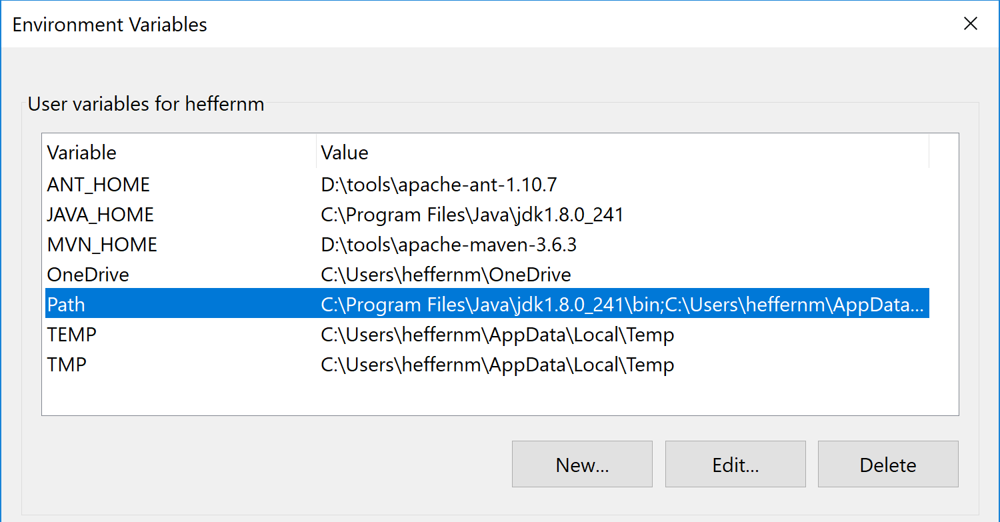
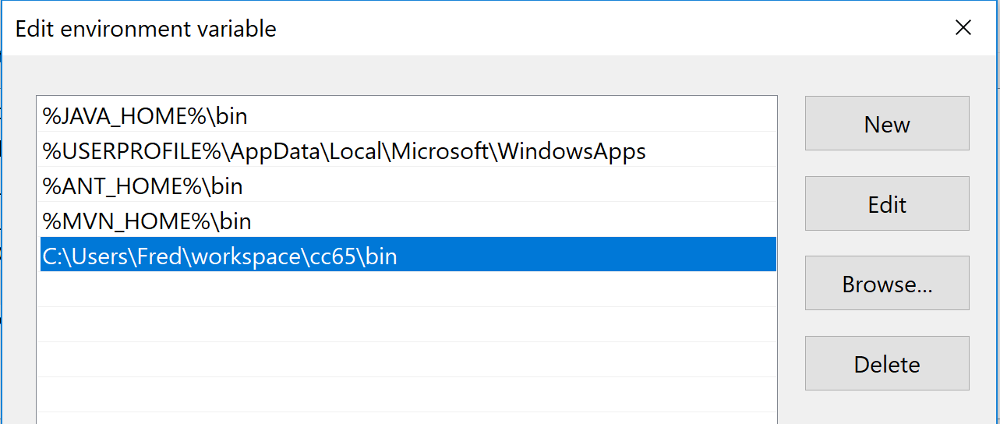

# x16-hello-cc65
This project contains "Hello World" examples for the Commander X16
using assembly and C with the cc65 toolchain. This README also serves as
general instructions for setting up a development environment. Most of this
only has to be done once, and then you'll be all set to build any cc65 project,
either of your own creation or any open source one, including the Commander X16
emulator itself!

How you build your code is different depending on what platform you are running.
At this point, Windows is supported through Cygwin, and Linux is supported with
special instructions here for Debian/Ubuntu distributions.

# Building with Windows (Windows Subsystem for Linux)

The build toolchain for this project requires a GNU environment, which is
natively available on most Linux and Unix (include Mac) platforms. For
Windows 10, a great option is to install the Windows Subsystem for Linux, 
which will give you a genuine Linux distro running on your Windows PC.

If you do not have WSL installed, follow the instructions found here:
[https://docs.microsoft.com/en-us/windows/wsl/install-win10](https://docs.microsoft.com/en-us/windows/wsl/install-win10)

You can install a Ubuntu or Debian distro during this process. Having done so,
follow the instructions under **Building with Debian/Ubuntu Linux** to build
**cc65** and the sample code from this repo.

Another advantage of using WSL is that you can develop your projects using
the VS Code editor, by installing the Remote Development extension. Follow
the instrcutions here to do that:
[https://code.visualstudio.com/docs/remote/wsl](https://code.visualstudio.com/docs/remote/wsl)

# Building with Windows (Cygwin)

The build toolchain for this project requires a GNU environment, which is
natively available on most Linux and Unix (include Mac) platforms. For
Windows, you will need a program called Cygwin that will provide a GNU
userspace in Windows that will give you a Unix-like environment for development.

## Installing and Configuring Cygwin

First, you will need to download the Cygwin setup program from here:
https://cygwin.com/setup-x86_64.exe

When you run the program, it will ask you which packages you want to install.
Make sure the following packages are selected:

- git
- gcc-core
- make

Then, when Cygwin is installed, open the Cygwin Terminal program (you can
specify to have a shortcut put on your desktop during the install) and cd
to whatever directory you want to maintain your workspace. In Cygwin, the
drive letters are also second-level directories, so your C drive is /cygdrive/c/
and your D drive is /cygdrive/d/, etc. If my Windows username is **Fred** and
I want to put a "workspace" directory in my profile alongside my "Documents"
directory, I can do the following:

```
$ cd /cygdrive/c/Users/Fred
$ mkdir workspace
$ cd workspace
```

There, you can use git to clone this repository with the following command:

```
$ git clone https://github.com/SlithyMatt/x16-hello-cc65.git
```

You will also need to clone the cc65 repo:

```
$ git clone https://github.com/cc65/cc65.git
```

Now, you can first test your new build environment by building cc65:

```
$ cd cc65
$ make
```

This should create a "bin" subdirectory with all the cc65 tools you will need,
like ca65.exe. You can either add this cc65/bin directory to your path, or add
symbolic links within Cygwin in /usr/bin.

## cc65 Option 1: Changing Path

Open up your Environment Variables control panel in your settings (you can find it by searching for "env"). Select the "Path" variable and click the "Edit..." button.



Then, in the editor dialog that pops up, add a new entry for your cc65/bin directory.
You can find it by clicking on the "Browse..." button.



Then click the "OK" button. You should be all set to run the cc65 tools from anywhere on Windows.
If your Cygwin Terminal was left open during this change, you will need to close it
and reopen it for the new environment to take effect.

## cc65 Option 2: Adding Symbolic Links

You can just add the cc65 tools that you need for the build as symbolic links to your Cygwin /usr/bin directory, which is already on the Cygwin bash path, but will not be on your general Windows
path.

Simply create the following links (you don't need to worry about superuser privileges in Cygwin):

```
$ cd /usr/bin
$ ln -s /cygdrive/c/Users/Fred/workspace/cc65/bin/ca65.exe
$ ln -s /cygdrive/c/Users/Fred/workspace/cc65/bin/cc65.exe
$ ln -s /cygdrive/c/Users/Fred/workspace/cc65/bin/cl65.exe
```

Your environment should be all set now.

## Building in Cygwin

Now, just go back to the root directory of this project and run the make utility.

```
$ cd /cygdrive/c/Users/Fred/workspace/x16-hello-cc65
$ make
```

And that's it! All the programs should be built.

# Building with Debian/Ubuntu Linux

Chances are, you have most of what you need already in Linux, but to be sure,
you can install all of the required packages in one command:

```
$ sudo apt-get install git build-essential
```

Then, you should create a workspace directory to hold all of your local repo
clones, like ~/workspace.

```
$ cd
$ mkdir workspace
$ cd workspace
```

There, you can use git to clone this repository with the following command:

```
$ git clone https://github.com/SlithyMatt/x16-hello-cc65
```

You will also need to clone the cc65 repo:

```
$ git clone https://github.com/cc65/cc65.git
```

Now, you can first test your new build environment by building cc65:

```
$ cd cc65
$ make
```

This should create a "bin" subdirectory with all the cc65 tools you will need,
like ca65.exe. You will need to add this directory to your PATH by adding the following
line to ~/.bashrc:

```
export PATH=$PATH:$HOME/workspace/cc65/bin
```

To make this environment take hold, you will need to close and reopen your terminal.
Then, you can go ahead and build this project using the make tool.

```
$ cd ~/workspace/x16-hello-cc65
$ make
```

And that's it! All the programs should be built.

# Troubleshooting

If your build doesn't seem to work as intended, there is a "clean" make target
at every level. You can always cd to the root of your project workspace and
do this to make sure everything is built clean:

```
make clean
make
```

# Running

If you do the top-level build, there will be three different X16 programs
built:

* asm/HELLOASM.PRG - Prints "HELLO, WORLD!" using only assembly language
* c/HELLOC.PRG - Prints "HELLO, WORLD!" using only C
* mixed/HELLOMIX.PRG - Prints "HELLO, WORLD!" using a mix of C and assembly

You can *cd* into any of these directories and run these programs with the
X16 emulator either from the host command line, or from the BASIC prompt
in the emulator.

For example, here's how to run the assembly version from the host command line:

```
$ cd asm
$ x16emu -prg HELLOASM.PRG
```

Then in the emulator at the **READY.** prompt:

```
READY.
RUN
```

Or, just load it from within the emulator. So first, just launch the emulator from
the directory containing the program:

```
$ cd asm
$ x16emu
```

Then in the emulator at the **READY.** prompts:

```
READY.
LOAD "HELLOASM.PRG"

READY.
RUN
```

And that's it! You can try adding your own assembly and/or C code to these
three examples and try it out by simply rebuilding using **make**. To speed
things up, just call **make** from the subdirectory where you made the change.

Better yet, please use this as a template for your own application. Just be
aware that if you use C, your **main** will have to be implemented in C and
then all assembly either linked in, or inlined.

For more information on how to write code for cc65, check out the
[documentation](https://cc65.github.io/doc/).

See video on YouTube:

[](https://youtu.be/t0jU2MjvCM0)
